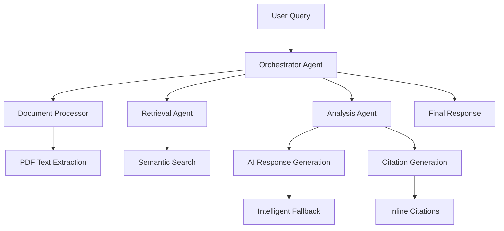

# Sarepta FDA Analysis Framework

> **Multi-Agent Document Analysis System for Elevidys Gene Therapy Research**

An app for analyzing FDA documents, clinical studies, press reports, and SEC filings related to Sarepta Therapeutics' Elevidys gene therapy controversy.

## 🚀 Live Demo

**[View Live Demo](https://rohitium.github.io/sarepta-fda-2025/)** 

## ✨ Features

- **🤖 Multi-Agent AI System** - Specialized agents for document processing, retrieval, analysis, and citation
- **📄 Document Collection** - 51 documents across 5 categories
- **🔍 Document Search** - Semantic search with concept mapping
- **📎 Citations** - Professional journal-style citations with clickable PDF access
- **📱 Modern UI** - Clean, responsive interface built with Next.js and Tailwind CSS

## 📊 Document Collection

| Category | Count | Examples |
|----------|-------|----------|
| **🏛️ FDA Documents** | 24 | Clinical Reviews, Approval Letters, Safety Memos |
| **📚 Publications** | 19 | Clinical Studies, EMBARK Trial Results, Safety Analyses |
| **📰 Press Reports** | 4 | Regulatory Actions, Safety Alerts, Market Response |
| **💼 SEC Filings** | 2 | 10-K Reports, 8-K Filings |
| **📋 Abstracts** | 2 | Research Summaries |

## 🛠️ Quick Start

### 1. Clone and Install
```bash
git clone https://github.com/rohitium/sarepta-fda-2025.git
cd sarepta-fda-2025
npm install
```

### 2. Environment Setup (Optional)
```bash
cp env.template .env.local
# Edit .env.local to add your OpenAI API key (optional for enhanced responses)
```

### 3. Start Development Server
```bash
npm run dev
```

Visit `http://localhost:3000` and spin this app locally!

## 🌐 Deploy to GitHub Pages

### Automatic Deployment
1. **Fork this repository**
2. **Enable GitHub Pages**: Settings → Pages → Source: "GitHub Actions"
3. **Push to main branch** - deployment happens automatically!

### Manual Deployment
```bash
# Build for production
npm run build
npm run export

# Deploy the 'out' folder to your hosting provider
```

## 🏗️ Architecture Overview



### Core Agents

1. **📄 Document Processor** - Extracts and chunks PDF content with metadata
2. **🔍 Retrieval Agent** - Semantic search with concept mapping
3. **🧠 Analysis Agent** - Generates responses using OpenAI GPT-4 (with fallback)
4. **📎 Citation Agent** - Creates inline citations with proper source tracking
5. **🎯 Orchestrator** - Coordinates the multi-agent workflow

## 💻 Development Commands

```bash
npm run dev          # Start development server
npm run build        # Build for production
npm run export       # Generate static files for GitHub Pages
npm run lint         # Run ESLint
npm run type-check   # Run TypeScript checks
```

## 🎯 How to Use

1. **Browse Documents** - Explore PDFs in the left sidebar organized by category
2. **Ask Questions** - Use natural language queries about Elevidys, clinical trials, safety, etc.
3. **Click Citations** - Inline citations are clickable and open the actual PDF documents
4. **View Sources** - All relevant sources are listed at the bottom of each response

### Example Queries

- *"What were the clinical trial results for Elevidys?"*
- *"What safety concerns were raised by the FDA?"*
- *"How did Sarepta respond to regulatory scrutiny?"*
- *"What was the basis for accelerated approval?"*

## 🔧 Repository Structure

```
sarepta-fda-2025/
├── public/pdf/              # PDF document collection
├── src/
│   ├── agents/             # Multi-agent system
│   │   ├── BaseAgent.ts    # Abstract base class
│   │   ├── DocumentProcessor.ts
│   │   └── Orchestrator.ts
│   ├── components/         # React components
│   │   ├── ChatInterface.tsx
│   │   └── DocumentSidebar.tsx
│   ├── lib/               # Utilities
│   │   ├── document-loader.ts
│   │   └── openai-client.ts
│   └── types/             # TypeScript definitions
├── .github/workflows/     # GitHub Actions
└── next.config.js        # Next.js configuration
```

## 🎨 Key Features

### Search System
- **Concept Mapping** - Maps queries to domain-specific terms
- **Document Type Boosting** - Prioritizes relevant document categories
- **Semantic Understanding** - Goes beyond keyword matching

### Professional Citations
- **Inline Citations** - `[Clinical Review]`, `[Approval Letter]` format
- **Clickable Sources** - Direct PDF access from citations
- **Comprehensive Source Lists** - Shows all relevant documents (not just 3)

### Intelligent Responses
- **Real AI Integration** - OpenAI GPT-4 when API key provided
- **Smart Fallbacks** - High-quality responses even without API key
- **Context-Aware** - Uses actual document content for responses

## 📈 Performance

- **⚡ Fast Loading** - Optimized static generation
- **📦 Lightweight** - Efficient bundle size (~2MB total)
- **🔄 No Runtime Dependencies** - Works entirely client-side
- **🌐 CDN Ready** - Perfect for GitHub Pages, Vercel, Netlify

## 🤝 Contributing

1. Fork the repository
2. Create your feature branch (`git checkout -b feature/amazing-feature`)
3. Commit your changes (`git commit -m 'Add amazing feature'`)
4. Push to the branch (`git push origin feature/amazing-feature`)
5. Open a Pull Request

## 📄 License

This project is licensed under the MIT License - see the [LICENSE](LICENSE) file for details.

## 🔬 Research Context

This framework analyzes the complex regulatory and safety landscape surrounding Sarepta Therapeutics' Elevidys (delandistrogene moxeparvovec), the first gene therapy approved for Duchenne muscular dystrophy. The analysis covers:

- **FDA accelerated approval pathway** (June 2023)
- **Post-market safety signals** including hepatotoxicity cases
- **Regulatory actions** and company responses
- **Clinical trial data** from EMBARK and extension studies
- **Financial and market impact** analysis